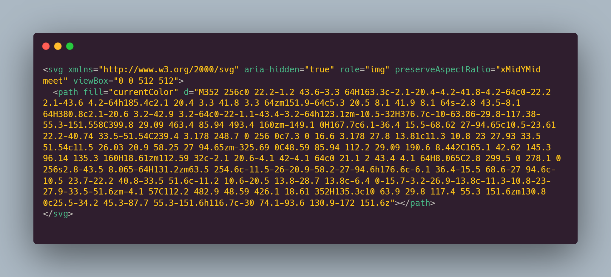
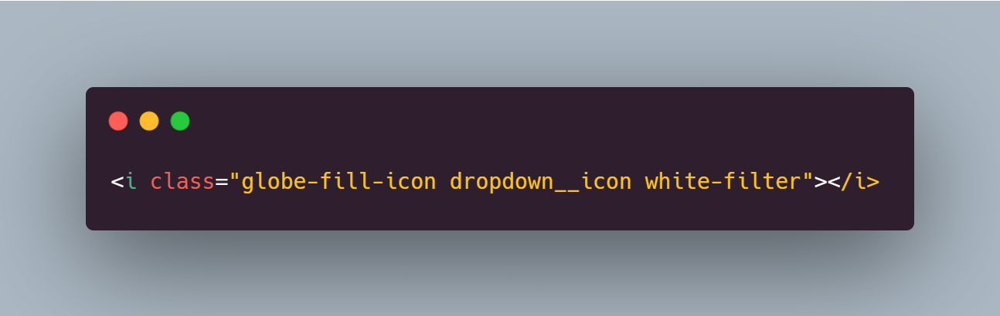
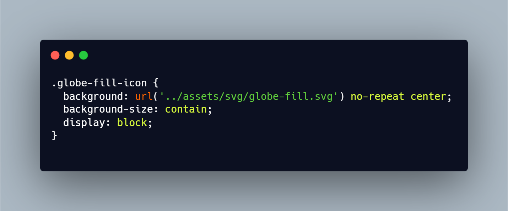
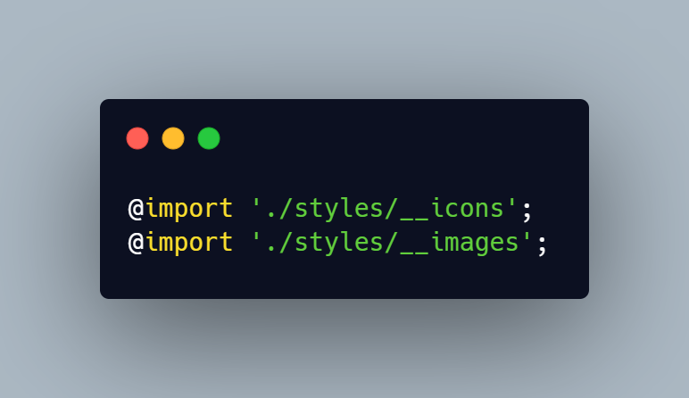

<h1 align="center"><b>Rotten Joysticks</b></h1>

List, login, create and vote games!

<strong>
<a href="https://rotten-joysticks.vercel.app/">Experimente a aplicação no ar</a>
</strong>
<strong>
<a href="https://rotten-joysticks.vercel.app/">See the application online</a>
</strong>

    <a href="#demo">Demo</a> •
    <a href="#tecnologias">Tecnologias</a> •
    <a href="#features">Features</a> •
    <a href="#login">Login</a> •
    <a href="#decisões">Decisões</a> •
    <a href="#autor">Autor</a>

---
### <b>Demo</b>

  
<small style="font-size: 10px"><kbd>(Espere o gif carregar)</kbd></small>

---

### <b>Tecnologias</b>

- [x] <b style="font-size: 12px">Angular</b>
- [X] <b style="font-size: 12px">Redux (NGRX)</b>
- [X] <b style="font-size: 12px">RXJS</b>
- [x] <b style="font-size: 12px">TypeScript</b>
- [x] <b style="font-size: 12px">HTML</b>
- [x] <b style="font-size: 12px">CSS (SCSS)</b>

---
### <b>Features</b>

- [X] <b style="font-size: 12px"><i>Paginação</i></b>
  
- [X] <b style="font-size: 12px"><i>Rotas</i></b>

- [x] <b style="font-size: 12px"><i>Gerenciamento de Estado</i></b> por `NGRX` <a href="https://chrome.google.com/webstore/detail/redux-devtools/lmhkpmbekcpmknklioeibfkpmmfibljd?hl=pt-BR"><b style="font-size: 12px">(instale a extensão para navegador)</b></a>

- [X] <b style="font-size: 12px"><i>Login e Autenticação por JWT</i></b> <a href="#login"><b style="font-size: 12px">(informação de login abaixo)</b></a>

- [X] <b style="font-size: 12px"><i>Carousel vanilla</i></b>

---
### <b>Login</b>

A API fornecida para o projeto (que foi um teste técnico) não oferece possibilidade de novo cadastro, em vez disso o email e a senha para login (necessário para exclusão e adição de novos jogos) estão listados abaixo:

`Email:` <kbd>master@tindin.com.br</kbd>

`Senha:` <kbd>123</kbd>

---
### <b>Decisões</b>

- [X] <b style="font-size: 13px">Nada de `Bootstrap`, `Material Design`, `Font Awesome` ou `Tailwind`</b>
  
    Foi utilizado em todo o projeto CSS puro, como SCSS como pré-processador. Por que não usar bibliotecas CSS os famosos "frameworks"? Usar CSS puro em todas as ocasiões me permite organizar melhor meu html, de forma que se você olhar o `DevTools` pelo navegador não vai ver uma coleção indistinta de classes estranhas juntas, serão nomes semânticos como `pagination`, `card`, `add-game`, `display`, `slider`. 

    O código fica mais limpo, fácil de entender e de dar manutenção. Graças aos componentes não existe repetição de código. E diminuí e muito o peso das centenas de classes de css que eu não iria utilizar.

    Algumas animações somente possíveis com CSS foram adicionadas. Se eu tivesse utilizado qualquer biblioteca dessas meu trabalho teria ficado mais do mesmo, sem muito apelo visual. É claro que para usar todo o poder do CSS sem criar um pattern caótico é necessário domínio e foi esse foi um dos motivos de eu ter escolhido usar CSS puro, num contexto de um projeto talvez seja preferível por outros fatores utilizar alguma biblioteca do gênero, mas isso não será um problema. Porque quem domina o CSS irá dominar qualquer framework seja ele `Bootstrap`, `Material Design`, `Font Awesome` ou `Tailwind`.

- [X] <b style="font-size: 13px">Não há responsividade (Leia)</b>

  Por se tratar de um teste técnico não houve prazo para adição de responsividade. Esse projeto foi focado no consumo da API fornecida.
  
  <b>``Mas``</b>, um Projeto responsivo até 280px, com paginação, ordenação alfabética e numérica, campo de pesquisa avançado, uso maior do NGRX, tradução e troca de temas claro e escuro já foi feito e você pode conferir ele agora.

  Link do site hospedado na Vercel: <a href="https://pokedex-thalyssonleite.vercel.app"><b style="font-size: 12px">pokedex-thalyssonleite.vercel.app</b></a>

  Link do repositório Github: <a href="https://github.com/ThalyssonLeite/pokedex"><b style="font-size: 12px">github.com/ThalyssonLeite/pokedex</b></a>

  Eu o <b>desafio</b> a quebrar o layout no projeto acima (feito 100% com SCSS puro).

- [X] <b style="font-size: 13px">Uso de gerenciamento de estado</b>

  O gerenciamento de estado me ajudou em diversas situações no debug e numa aplicação maior faria toda a diferença. Durante o desenvolvimento do projeto foi de vital importância a compreensão visual do estado da aplicação. Usando a extensão do Redux <a href="https://chrome.google.com/webstore/detail/redux-devtools/lmhkpmbekcpmknklioeibfkpmmfibljd?hl=pt-BR"><b style="font-size: 12px">(instale a extensão para navegador)</b></a> ficou claro o que estava acontecendo e que gargalos de perfomance poderiam ser diminuídos e como fazer isso.

  Ter uma estrutura bem definida, uma única fonte, de onde todos os componentes podem beber, cria um código mais previsível e organizado.
- [X] <b style="font-size: 13px">`__icons.scss` e `__images.scss` patern</b>
  
  O que é melhor?
  
  Isso:
  
  

  ou isso:

  

  Ambos produzem o exato mesmo resultado com o segundo exemplo não tendo linhas ilegíveis de códgigo, sem imports, e com uma classe descritiva: `globe-fill-icon`. As classes `dropdown__icon` e `white-filter` setam as dimensões do ícone e a cor respectivamente. Mas o que faz a classe `globe-fill-icon`? Ela carrega a referência do SVG importado como background, uma `utility class` criada a mão que pode ser usada globalmente na aplicação. Se este ícone mudar de import no futuro (por exemplo se houver uma reorganização de pastas), ele será alterado em apenas 1 lugar e todos os lugares onde ele é chamado refletirão o resultado. O que não iria acontecer, por exemplo, se importássemos a referência do arquivo dentro de uma `img` tag, nesse caso se o import mudasse, TODOS os lugares onde aquela imagem fosse chamada não iriam mais funcionar e teriam de ser refatoradas.

  Nas classes com esse pattern usamos o sufixo `icon` para ícones e `image` para imagens. A coleção desses ícones está dentro de um único arquivo SCSS que vai ser importado dentro do `styles.scss`, a partir daí essas classes ficarão distribuídas globalmente na aplicação.

  Esse é um exemplo de como uma classe é criada dentro do arquivo `__icons.scss`:

  

  Depois os arquivos partials `__icons.scss` e `__images.scss` serão importados dentro de `styles.scss` onde ficarão disponíveis globalmente:

  
---
### <b>Autor</b>

 Made with 🧡 and madness by Thalysson 🥛<a href="https://www.google.com/search?q=milk+in+portuguese&oq=milk+in+portuguese&aqs=chrome..69i57.4303j0j1&sourceid=chrome&ie=UTF-8">(click here if you are not brazilian)</a>

